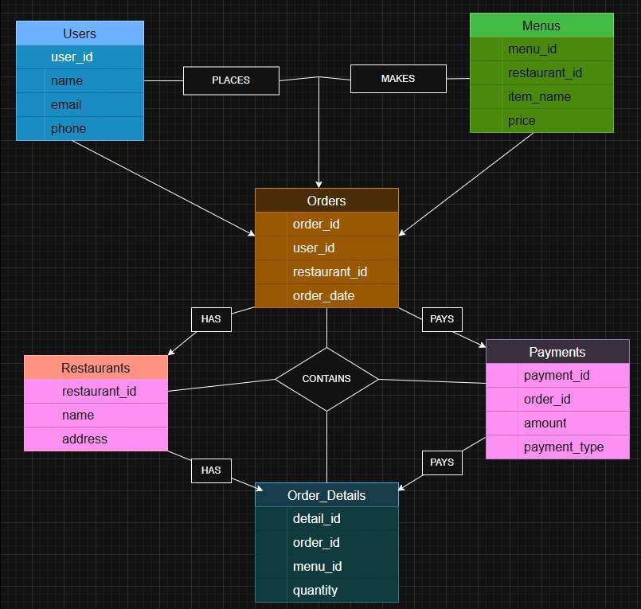

# Food-Ordering-DB-Design
Relational database design for a food-ordering platform (PostgreSQL) — 6 normalized tables, ER diagram, and 10 analytical SQL queries (JOINs, aggregation).

# Yemeksepeti-like Database Design & Implementation

A relational database design for a Yemeksepeti-style online food ordering
platform, implemented in **PostgreSQL**. Users can browse restaurants, view
menus, place orders, and complete payments through the system.

## Entity-Relationship Diagram



## Entities

| Entity | Description |
|---|---|
| **Users** | People placing food orders |
| **Restaurants** | Restaurants listed on the platform |
| **Menus** | Menu items offered by each restaurant |
| **Orders** | An order placed by a user at a restaurant |
| **Order_Details** | Line items within an order (menu item + quantity) |
| **Payments** | Payment record tied to an order |

**Relationships:** a user can place many orders; a restaurant can offer many
menu items; each order belongs to exactly one user and one restaurant,
contains multiple menu items (via `order_details`), and has one payment
record.

## Schema

Full table definitions with primary/foreign keys are in
[`schema.sql`](schema.sql).

```sql
CREATE TABLE orders (
    order_id SERIAL PRIMARY KEY,
    user_id INT REFERENCES users(user_id),
    restaurant_id INT REFERENCES restaurants(restaurant_id),
    order_date TIMESTAMP
);
```

## Queries

[`queries.sql`](queries.sql) contains 10 analytical queries demonstrating
JOINs, aggregation (`SUM`, `COUNT`), and sorting. A few highlights:

**Total amount per order** (JOIN + GROUP BY + SUM):
```sql
SELECT o.order_id, SUM(m.price * d.quantity) AS total_amount
FROM orders o
JOIN order_details d ON o.order_id = d.order_id
JOIN menus m ON d.menu_id = m.menu_id
GROUP BY o.order_id;
```

**Most ordered menu item** (JOIN + GROUP BY + ORDER BY + LIMIT):
```sql
SELECT m.item_name, SUM(d.quantity) AS total_quantity
FROM order_details d
JOIN menus m ON d.menu_id = m.menu_id
GROUP BY m.item_name
ORDER BY SUM(d.quantity) DESC
LIMIT 1;
```

Other queries cover: listing users/restaurants, restaurant menus, orders per
user, order details, most expensive menu item, order count per restaurant,
and payment type breakdown.

## Tech Stack

- **PostgreSQL** — schema design, foreign key constraints, JOIN/GROUP BY
  based analytical queries

## How to Run

```bash
psql -U <your_user> -d <your_database> -f schema.sql
# insert sample data, then:
psql -U <your_user> -d <your_database> -f queries.sql
```

## Team

- Samet Güner (240316001)
- Egemen Darılmaz (220316063)

